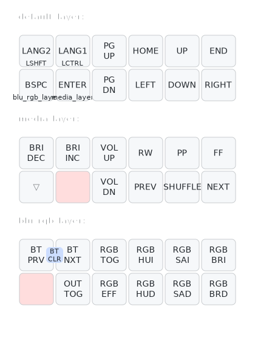

# magictrackrest-zmk-config

MagickTrackRest+BLEのZMKファームウェアです。

bluetooth接続時のデバイス名は「mtr」になります。

### ZMKファームウェア

MagickTrackRest+BLEのファームウェア
* [mtr-seeeduino_xiao_ble-zmk.uf2](firmware/mtr-seeeduino_xiao_ble-zmk.uf2)

　ファームウェア設定リセット用
* [settings_reset-seeeduino_xiao_ble-zmk.uf2](firmware/settings_reset-seeeduino_xiao_ble-zmk.uf2)

### デフォルトのキーマップ

QMKファームウェアを使用した自作キーボードと同様、通常操作（カーソル操作）以外の操作を行う場合、レイヤー切り替えキーを押しながらレイヤーを切り替えて操作を行います

Bluetooth,LED操作レイヤーに切り替え
  * 下段左から１番目：Bluetooth、RGB操作レイヤーキー

メディア操作レイヤーに切り替え
  * 下段左から２番目：メディアレイヤー

#### キーマップ図 （[keymap-drawer](https://caksoylar.github.io/keymap-drawer?keymap_yaml=H4sIAAAAAAAC_22SzW6jMBSF93mKK2WbFk1GM4vskmB-NBQQkLSzQiY4BcXEjA1FUZTX6Nv0ZfokNTahiTQrPp_LPfdczBQs1_PA9SEjlHWwLwnNoSubAjC8YdoSoOWBwPlfdUgP5JQxzPMF7AnnpTBER0h9mUyBcTgz3hQspfjE2mYBZ1HTUj4b3pIZcNaJBfycwY7RtjpK_jWDpmirTOL80lsIQqBomlosDONVzm-zxx2rjB0-CHaimBtyeoXrh5zjjnAjoywzKlwejT_o79MyTOMQrR-rfKoDTIYcE4C7XPIMMETbYyqIEnS8ueIx4e_eg3DR9-Rkj1vapErphQc4Swdv6ds_ZlBIih0rudwV5rqwTiJPF0IbNqEiJ3hCCoYz8s2xdRWHa9WZ0Tblr5me-W2N_ARF6oWK5CW-LcsBpq_IQ1aiwAyetRK5ttNLN016j1XkgonWI7u-5m3gXeNFz9penyxrzPL5_iGv8VST_p7xUVxTKqWQf9JltBqChRHaKoidjWV5-iv46KWPdrfwEC6RHdsr-i96qcheQRLYIzsbd-R4-c1ynf8HCjbJnQEadtJm5o2ZeWNmTr4Abb4AYy4DAAA%3D)で作成）

### ペアリング

MagickTrackRest+BLEでは最大５台の機器とBluetooth接続、１台の機器とUSB接続可能です。

MagickTrackRest+BLEの電源を入れると、自動的にペアリングモードになります。

Buletoothの切り替えは、次のキーの組み合わせでおこないます。

* 下段左から１番目：Bluetoothレイヤーキーを押しながら
  * 上段左から１番目：前の機器に接続
  * 上段左から２番目：次の機器に接続

USB接続した機器に入力する場合、Blutooth/USBの出力先変更キーで切り替えます

* 下段左から１番目：Bluetoothレイヤーキーを押しながら
  * 下段左から２番目：USB／BTの出力切り替え

# zmkキーマップ変更、ファームウエアビルド

zmkのキーマップ変更、ファームウェアビルドはGitHubをブラウザで操作するだけで実行できます。

特別な開発ツールや外部サービスは不要です。

## githubアカウント準備、zmk-configフォーク

1. https://github.com/　に自分のアカウントでログイン

自分のキーマップや設定はGithubに保存します。
アカウントがなければ作成してください。

2. PersonalAccessTokenを用意

https://github.com/settings/tokens に移動して、PersonalAccessTokenを作成します。

トークン作成時に、"workflow" にチェックをつけてください。（この権限がないとファームウエアのビルドができません）

3. mentako-ya/magictrackrest-zmk-configに移動

自分のアカウントでgithubにログインしたまま、https://github.com/mentako-ya/magictrackrest-zmk-config　（このページ）を開きます。

画面右上の「Fork」メニューから「+ Create a new fork」を選択します。

４. フォーク作成
作成されるフォークが　自分のアカウント/magictrackrest-zmk-config　であることを確認して 「Create fork」 を押下します。

5. 自分のGithubリポジトリに移動し、「magictrackrest-zmk-config」がフォークされたことを確認します。

画面上部の「Actions」をクリック。利用許諾のメッセージが表示されていれば、許諾します。

## ファームウェアビルド

1. ファームウェアビルド

画面左側　Actions の中から.github/workflows/build.ymlをクリック

画面右側　RunWorkflow　のボタンをクリックするとファームウェアのビルドが開始すします。（２回目以降は変更をコミットすると、自動的にビルドされます）

2. ファームウェアダウンロード

生成された firmware.zipをダウンロードして解凍します。

* mtr-seeeduino_xiao_ble-zmk.uf2 　　　　　　　　　　　　　　　　　　　　　　　　　＜　ZMKファームウェア
* settings_reset-seeeduino_xiao_ble-zmk.uf2　　　　＜　ファームウェアリセット用

3. ファームウェア書き込み

MagicTrackaRestをUSBケーブルでPCに接続

リセットボタン（Xiao BLEのリセットボタンでもOK)を２回クリックすると、USBドライブ「XIAO SENSE」が接続されます。

]
USBドライブに解凍した mtr-seeeduino_xiao_ble-zmk.uf2 を保存するとUSBドライブが切断されてファームウェアが更新されます。

ファームウェア更新後際接続されない場合、次の手順で再接続してください。

* MagickTrackRestのリセットボタンを押下
* PC側でペアリングを解除し、「mtr」を再度ペアリング
* 再ペアリングでも接続できない場合、PC再起動して再接続
* それでもダメなら　settings_reset-seeeduino_xiao_ble-zmk.uf2 でファームウェアを初期化 → ファームウェア書き込みからやり直し

## キーマップ修正　

フォークしたリポジトリの mtr.keymap を修正します。

修正したファイルをコミットすると、自動的にファームウェアがビルドされます。

ビルドされたファームウェア（キーマップが変更されたファームウェア）をダウンロードして、書き込んでください。

上記サンプルのキーマップ変更内容は[こちら](https://github.com/taro-sj/magictrackrest-zmk-config/commit/d78b132d17b3deafa63dcc6ea460ff6c57af808f)

### キーコード

mtr.keymap の各キーコードは　”＆ｘｘ” のビヘイビア（振る舞い）　と、キーコードのセットで記述します。

通常キーのキーコード（&kpのキー）についてはZMKのドキュメントを参照してください。

  https://zmk.dev/docs/codes

その他各種機能キーについてはドキュメントの各セクションを参照してください

  [Bluetoothコントロール &bt](https://zmk.dev/docs/behaviors/bluetooth)

  [RGBコントロール &rgb_ug](https://zmk.dev/docs/behaviors/underglow)
  
  [Hold-Tap　Shift等にタップ操作を追加 &mt](https://zmk.dev/docs/behaviors/hold-tap)

  [Mod-Tap　レイヤー切り替えとタップ &lt](https://zmk.dev/docs/behaviors/mod-tap)
